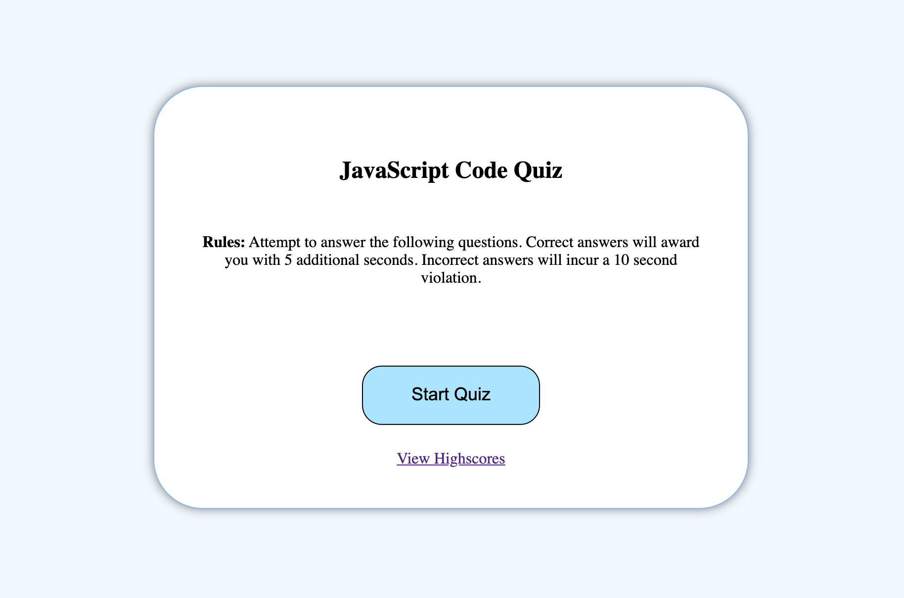
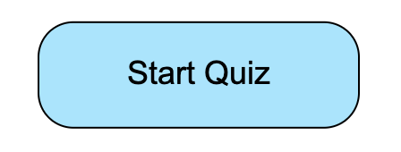
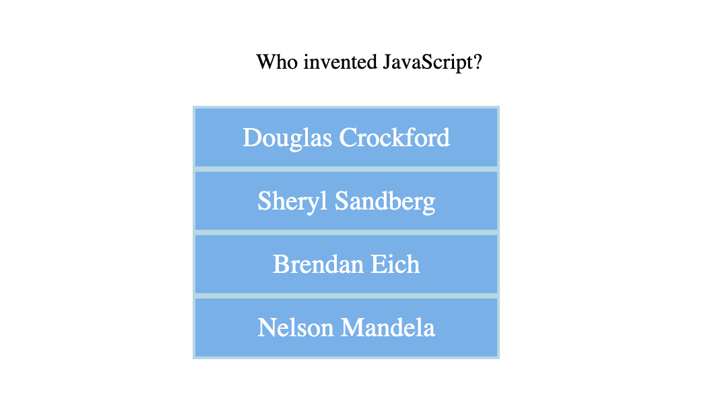
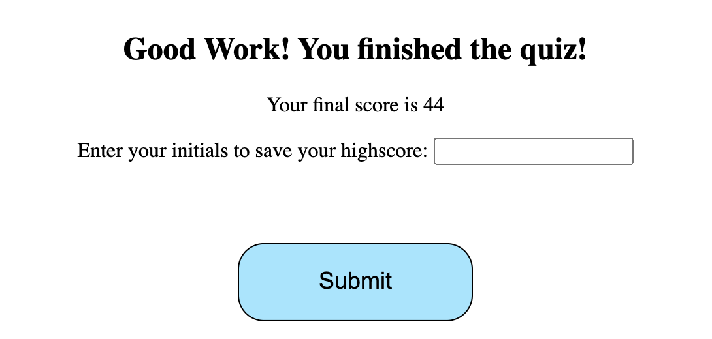
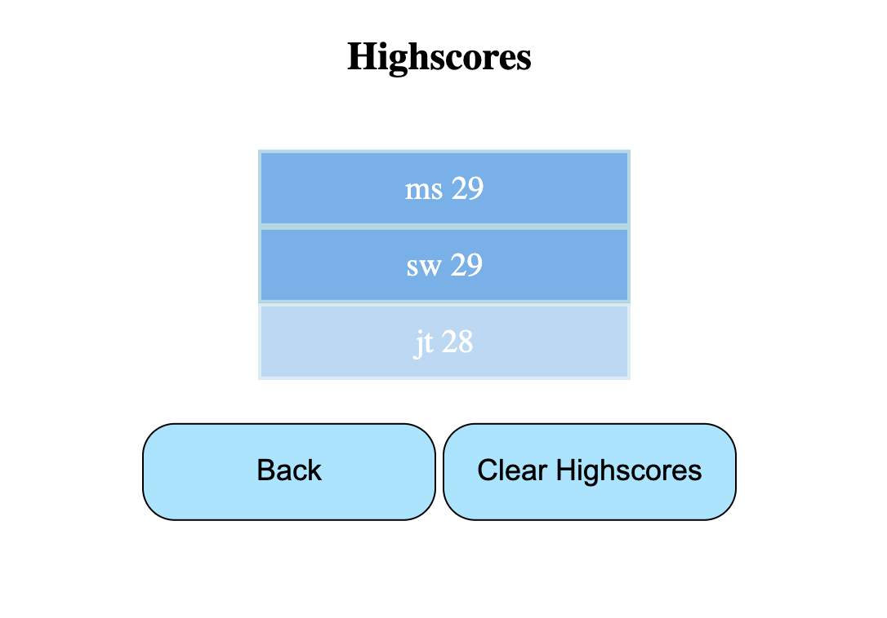

# Code-Quiz

## Completed by Michael Shaw 
## UWA Coding Bootcamp: Week 4 Homework Assignment

This JavaScript Code Quiz was created for a homework assignment for UWA's coding bootcamp.

This application makes use of JavaScript to display quiz questions and records the users score to a highscores list. 



### Getting Started

This project has been deployed to GitHub Pages. To use the quiz, you can follow the deployment link. Or, download the source files to use this as a template.

* [Deployed GitHub IO](https://michaelshxw.github.io/Code-Quiz/)
* [GitHub Repository](https://github.com/michaelshxw/Code-Quiz)

### Prerequisites
To install this application, a text editor such as Visual Studio Code is required. This can be downloaded [here.](https://code.visualstudio.com/download)

### Languages Used
* HTML 
* CSS
* JavaScript

### Installation
To install this code, download the zip file, or use GitHub's guidelines to clone the repository

### Summary
* This JavaScript code quiz uses HTML, CSS and JavaScript to display a quiz once the start button has been clicked. It also features a timer, and a highscore function to allow users to log their highscores.
* This project highlights the use of JavaScript to make dynamic changes to a HTML document.


### Project Features
* A Start Quiz button
    * When this button is click, the timer starts and the quiz questions are displayed



* A Quiz Questions section
    * This area is where the quiz questions are displayed. The user can choose their answers and the next question will appear.



* A End of Quiz section 
    * This section displays the users final score, as well a section to enter their intials and a submit button to submit their highscore.



* A Highscore section 
    * This section displays all the users highscores that have been submitted.


    
### Project Requirements 

Below is the acceptance criteria that was given for the homework assignment
```
GIVEN I am taking a code quiz
WHEN I click the start button
THEN a timer starts and I am presented with a question
WHEN I answer a question
THEN I am presented with another question
WHEN I answer a question incorrectly
THEN time is subtracted from the clock
WHEN all questions are answered or the timer reaches 0
THEN the game is over
WHEN the game is over
THEN I can save my initials and my score
```

### Authors
* **Michael Shaw** (HTML, CSS and JavaScript) [GitHub Profile](https://github.com/michaelshxw)
